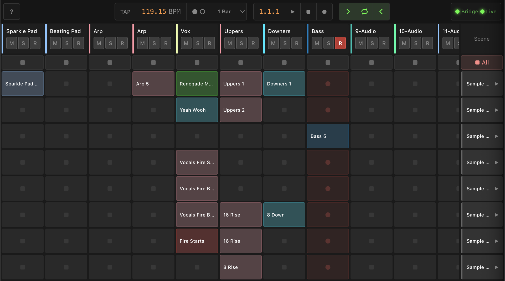

# Mission Control

Launch clips and control Ableton Live from any browser. Inspired by the legendary [Novation Launchpad](https://amzn.to/4by97mP).



## Features

- **Transport Control** — Play, stop, record, tap tempo, punch in/out, loop toggle
- **Clip Launching** — Fire and stop clips with quantization support (1/32 to 8 bars)
- **Scene Launching** — Trigger entire scenes with one click
- **Track Controls** — Mute, solo, and arm per track
- **Drag & Drop** — Move clips between tracks with automatic type validation
- **Real-time Sync** — Instant bidirectional updates between Ableton and the UI
- **Visual Feedback** — Color-coded clips, playback progress indicators, playing states

## Download

| Release | Description |
|---------|-------------|
| [**Latest**](https://github.com/ryangavin/mission-control/releases/latest) | Stable release, recommended for most users |
| [**Edge**](https://github.com/ryangavin/mission-control/releases/tag/edge) | Bleeding edge build from main, updated on every commit |

## Quick Start

### 1. Download

Grab the latest release for your platform from [GitHub Releases](https://github.com/ryangavin/mission-control/releases/latest).

### 2. Install the Remote Script

Launch Mission Control, then click the tray icon → **Install Remote Script**.

Or manually: download [AbletonOSC](https://github.com/ideoforms/AbletonOSC) and copy the `AbletonOSC` folder to:

- **macOS**: `~/Music/Ableton/User Library/Remote Scripts/`
- **Windows**: `~\Documents\Ableton\User Library\Remote Scripts\`

### 3. Enable in Ableton

In Ableton Live, go to **Preferences → Link, Tempo & MIDI → Control Surface** and select **AbletonOSC**.

### 4. Connect

Open a Live Set. Click the tray icon → **Show UI**. The connection status indicator will turn green when connected.

## Documentation

For detailed usage instructions, see the **[User Manual](docs/MANUAL.md)**.

## Requirements

- [Ableton Live](https://www.ableton.com/live/) 10, 11, or 12
- macOS or Windows

## Development

### Setup

```bash
# Install dependencies
bun install

# Start the development server
bun run dev
```

Open [http://localhost:5173](http://localhost:5173) in your browser.

### Building

```bash
# Build web assets
bun run build

# Build standalone bridge server
bun run build:bridge

# Build desktop app
bun run tauri:build
```

Platform-specific bridge binaries:

```bash
bun run build:bridge:mac-arm   # macOS Apple Silicon
bun run build:bridge:mac-x64   # macOS Intel
bun run build:bridge:win       # Windows x64
```

### Project Structure

```
mission-control/
├── client/          # Svelte 5 frontend
├── server/          # Bridge server (OSC ↔ WebSocket)
├── protocol/        # Type-safe message protocol
└── desktop/         # Tauri desktop app
```

### Tech Stack

- **Frontend**: [Svelte 5](https://svelte.dev) + [Vite](https://vitejs.dev)
- **Runtime**: [Bun](https://bun.sh)
- **Desktop**: [Tauri 2](https://tauri.app) (Rust)
- **Protocol**: OSC via [osc-js](https://github.com/adzialocha/osc-js)

## How It Works

Mission Control acts as a bridge between your browser and Ableton Live:

```
Browser ←—WebSocket—→ Bridge Server ←—OSC—→ Ableton Live (AbletonOSC)
```

The bridge server translates WebSocket messages to OSC commands and vice versa, enabling real-time control from any modern browser.

## Contributing

Contributions are welcome! Please open an issue to discuss significant changes before submitting a PR.

## License

[GPL-3.0](LICENSE)
