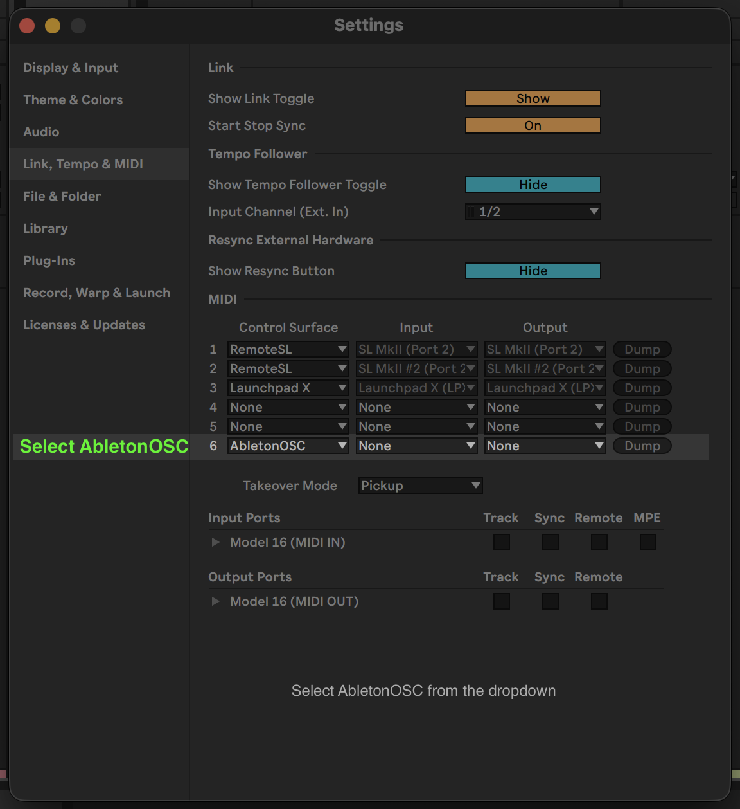

# Mission Control User Manual

Mission Control is a browser-based controller for Ableton Live. Launch clips, control transport, and mix your tracks from any device on your network.

---

## Getting Started

### Requirements

- **Ableton Live** 10, 11, or 12
- **macOS** or **Windows**

### Installation

1. **Download** the latest release from [GitHub Releases](https://github.com/ryangavin/mission-control/releases/latest)
2. **Install** the app:
   - **macOS**: Open the DMG and drag Mission Control to Applications
   - **Windows**: Run the installer

### Setting Up Ableton Live

Mission Control communicates with Ableton through a remote script called AbletonOSC.

1. **Install the Remote Script**
   - Click the Mission Control icon in your system tray
   - Select **Install AbletonOSC**
   - The script will be installed automatically

2. **Enable in Ableton**
   - Open Ableton Live
   - Go to **Preferences** → **Link, Tempo & MIDI**
   - Under **Control Surface**, select **AbletonOSC**

   

3. **Connect**
   - Open or create a Live Set
   - Click the tray icon → **Open Mission Control**
   - The connection indicator will turn green when connected

---

## The Interface

Mission Control mirrors the Session View in Ableton Live with a streamlined interface optimized for clip launching.

### Layout Overview

```
┌─────────────────────────────────────────────────────────┐
│  Header: Transport controls, tempo, connection status   │
├─────────────────────────────────────────────────┬───────┤
│                                                 │       │
│                                                 │ Scene │
│              Clip Grid                          │Column │
│                                                 │       │
│                                                 │       │
├─────────────────────────────────────────────────┴───────┤
│  Mixer Footer: Faders and track controls                │
└─────────────────────────────────────────────────────────┘
```

---

## Transport Controls

The header contains all transport and timing controls.

### Playback

| Control | Description |
|---------|-------------|
| **▶ Play** | Start playback. Lights up orange when playing. |
| **■ Stop** | Stop playback. Press twice to return to the start. |
| **● Record** | Toggle recording. Lights up red when active. |

### Tempo

- **TAP** — Click repeatedly to set the tempo by tapping
- **BPM Display** — Shows the current tempo. Drag left/right to adjust:
  - Drag right to increase tempo
  - Drag left to decrease tempo
  - Small movements for fine control (~0.15 BPM per pixel)

### Metronome

Click the **●○** button to toggle the click track on/off. Lights up orange when active.

### Quantization

The dropdown selector sets the **clip launch quantization** — how long clips wait before starting after you trigger them:

| Setting | Behavior |
|---------|----------|
| **None** | Clips start immediately |
| **8 Bars** | Clips wait for the next 8-bar boundary |
| **4 Bars** | Clips wait for the next 4-bar boundary |
| **2 Bars** | Clips wait for the next 2-bar boundary |
| **1 Bar** | Clips wait for the next bar |
| **1/2** | Clips wait for the next half note |
| **1/4** | Clips wait for the next quarter note |
| **1/8** | Clips wait for the next eighth note |
| **1/16** | Clips wait for the next sixteenth note |
| **1/32** | Clips wait for the next thirty-second note |

Settings with **T** (like 1/4T) use triplet timing.

### Loop & Punch

| Control | Description |
|---------|-------------|
| **▶ Punch In** | Start recording at the loop start point |
| **↻ Loop** | Toggle arrangement loop on/off |
| **◀ Punch Out** | Stop recording at the loop end point |

### Position Display

The **bar.beat.sixteenth** display (e.g., "1.1.1") shows the current playback position in musical time.

### Utility Buttons

| Button | Description |
|--------|-------------|
| **↻ Resync** | Force a full state refresh from Ableton. Use this if the UI gets out of sync. |
| **? Help** | Open the help panel with setup instructions, troubleshooting, and version info. |

---

## The Clip Grid

The main area displays your tracks (columns) and scenes (rows) in a grid.

### Track Headers

The top row shows track names with color indicators matching your Ableton tracks.

### Clip States

Clips display different visual states:

| State | Appearance | Meaning |
|-------|------------|---------|
| **Empty** | Dark cell with ■ icon | No clip in this slot |
| **Has Clip** | Colored cell with clip name | Clip is stopped |
| **Triggered** | Yellow, blinking | Clip will start at next quantization point |
| **Playing** | Green glow, progress bar | Clip is currently playing |
| **Recording** | Red glow, pulsing | Clip is recording |

### Clip Colors

Each clip displays its color from Ableton. The top border of each cell shows the clip's assigned color.

### Progress Indicator

Playing and recording clips show a progress bar at the top that fills from left to right as the clip plays through.

### Interacting with Clips

- **Click a stopped clip** → Trigger it to play
- **Click a playing clip** → Stop it
- **Click an empty slot** → Stop the track (if armed, starts recording)

### Armed Tracks

When a track is armed for recording, empty slots show a **●** record icon instead of a stop icon. Clicking an armed empty slot begins recording a new clip.

---

## Scenes

The **Scene Column** on the right side lets you launch entire rows of clips at once.

### Launching Scenes

Click any scene button to trigger all clips in that row simultaneously. This is useful for:

- Moving between song sections
- Triggering synchronized arrangement changes
- Live performance transitions

Scene names and colors match what you've set in Ableton Live.

---

## Track Controls

At the bottom of the interface, each track has dedicated control buttons.

### Mute / Solo / Arm

| Button | Color When Active | Function |
|--------|-------------------|----------|
| **M** (Mute) | Orange | Silence this track |
| **S** (Solo) | Yellow | Solo this track (mute all others) |
| **●** (Arm) | Red | Arm track for recording |

### Stop Track

The **■** button below each track stops all clips playing on that track.

### Stop All

The **■ All** button in the master section stops all clips across all tracks.

---

## The Mixer

The mixer footer provides volume and pan control for each track.

### Resizing

Drag the grip handle at the top of the mixer to resize:

- **Drag up** to expand the mixer and show faders
- **Drag down** to collapse and show only buttons
- The mixer remembers your preferred size

### Volume Faders

Vertical sliders control track volume. Drag up to increase, down to decrease.

### Pan Knobs

Horizontal sliders control stereo panning:
- **Center** = Mono/centered
- **Left** = Panned left
- **Right** = Panned right

### Master Section

The rightmost column controls the master output with its own volume and pan controls.

---

## Drag & Drop

Move clips between tracks by dragging them.

### How to Drag

1. Click and hold on a stopped clip
2. Drag to a new location
3. Release to drop

### Drag Rules

- **Playing or recording clips cannot be dragged** — stop them first
- **Audio clips** can only be dropped on audio tracks
- **MIDI clips** can only be dropped on MIDI tracks
- **Valid drop targets** highlight green
- **Invalid targets** dim and show a "not allowed" cursor

### Visual Feedback

| Indicator | Meaning |
|-----------|---------|
| Source clip dims | The clip you're dragging |
| Green dashed border | Valid drop target |
| ↻ symbol | Dropping here will replace an existing clip |
| Dimmed cells | Invalid drop targets |

### Deleting Clips

To delete a clip, drag it to the bottom of the screen. A red **Drop to Delete** zone will appear while dragging.

1. Click and hold on a stopped clip
2. Drag toward the bottom of the screen
3. The delete zone appears with a trash icon
4. Drop the clip in the zone to delete it

**Note:** This permanently removes the clip from your Ableton Live Set.

---

## Mobile Access

Control Ableton from your phone or tablet on the same network.

### Connecting a Mobile Device

1. Click the tray icon → **Connect on Mobile**
2. A QR code window will appear
3. Scan the QR code with your phone's camera
4. Mission Control opens in your mobile browser

### Requirements

- Your computer and mobile device must be on the same Wi-Fi network
- The QR code contains your computer's local IP address

### Mobile Tips

- The interface adapts to smaller screens
- Transport controls remain accessible
- Scroll horizontally to see all tracks
- The mixer collapses automatically on mobile

---

## System Tray Menu

Mission Control runs in your system tray (menu bar on macOS, system tray on Windows).

### Menu Options

| Option | Description |
|--------|-------------|
| **Help** | Open the user manual |
| **Open Mission Control** | Open the controller in your default browser |
| **Connect Another Device** | Show QR code for mobile device connection |
| **Install AbletonOSC** | Install or reinstall the Ableton remote script |
| **Start Automatically** | Launch Mission Control when you log in |
| **Check for Updates...** | Check for and install new versions |
| **Donate ❤️** | Support development via Ko-fi |
| **Quit** | Close Mission Control completely |

**Note:** Auto-update is not available for edge builds. Download the latest edge build manually from [GitHub Releases](https://github.com/ryangavin/mission-control/releases/tag/edge).

---

## Troubleshooting

### "Waiting for Ableton Live"

The connection indicator shows this when Mission Control can't communicate with Ableton.

**Solutions:**
- Make sure Ableton Live is running with a project open
- Check that AbletonOSC is selected in Preferences → Link, Tempo & MIDI → Control Surface
- Restart Ableton Live after installing the remote script

### AbletonOSC Not Appearing in Control Surface List

**Solutions:**
- Make sure the folder is named exactly `AbletonOSC` (no version numbers)
- Restart Ableton Live completely after installation
- Verify the script is in the correct location:
  - **macOS**: `~/Music/Ableton/User Library/Remote Scripts/`
  - **Windows**: `~/Documents/Ableton/User Library/Remote Scripts/`

### Controls Not Responding

**Solutions:**
- Check that AbletonOSC is still selected in Control Surface preferences
- Refresh the browser page
- Restart Ableton Live
- Restart Mission Control

### Mobile Device Can't Connect

**Solutions:**
- Ensure both devices are on the same Wi-Fi network
- Check that your firewall allows connections on port 5555
- Try typing the URL shown under the QR code manually

### Clips Not Syncing

**Solutions:**
- Verify the connection indicator is green
- Check that your Live Set has clips in Session View
- Try refreshing the browser

---

## Keyboard Shortcuts

Mission Control currently focuses on mouse/touch interaction. Keyboard shortcuts may be added in future versions.

---

## Version Information

Click the **?** help button in the top right corner, then select the **About** tab to see the current version.

---

## Getting Help

- **GitHub Issues**: [Report bugs or request features](https://github.com/ryangavin/mission-control/issues)
- **AbletonOSC**: [Documentation for the underlying protocol](https://github.com/ideoforms/AbletonOSC)

---

## Disclaimer

Mission Control is **beta software**. While it has been tested extensively, you may encounter bugs or unexpected behavior. Please back up your Live Sets before use and [report any issues](https://github.com/ryangavin/mission-control/issues) you encounter.

---

*Mission Control is open source software released under the GPL-3.0 license.*
